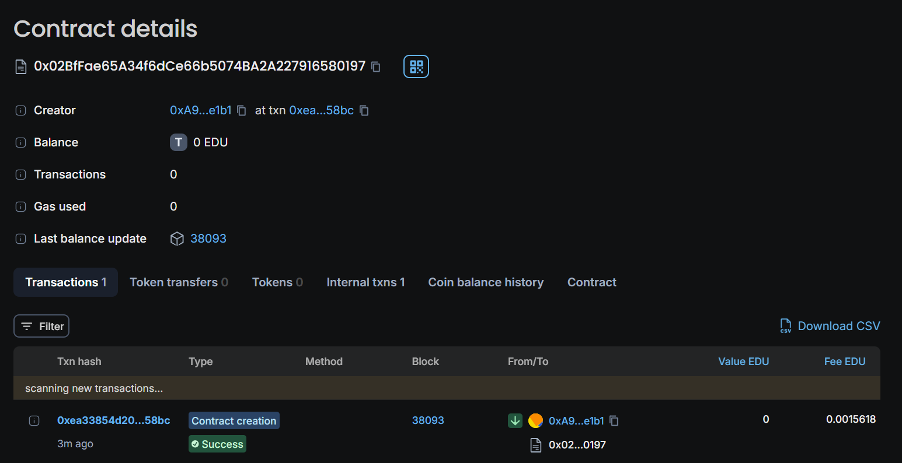

# Decentralized Academic Conference Platform

This project is a decentralized application (DApp) built on the Ethereum blockchain to manage academic conferences. The smart contract provides functionalities for organizers to create and manage events, allows speakers to submit papers, and enables attendees to vote on those papers. The platform ensures transparency and fairness through blockchain technology.

## Table of Contents

- [Overview](#overview)
- [Features](#features)
- [Prerequisites](#prerequisites)
- [Installation](#installation)
- [How It Works](#how-it-works)
- [Smart Contract Code](#smart-contract-code)
- [Usage](#usage)
- [Future Enhancements](#future-enhancements)
- [License](#license)

## Overview

The Decentralized Academic Conference Platform leverages smart contracts to handle event management, paper submissions, and voting in an open and decentralized manner. Organizers create events, speakers submit papers, and attendees cast votes, all recorded immutably on the Ethereum blockchain.

## Features

- **Organizer Management**: Only organizers can create new events.
- **Event Creation**: Organizers specify event details and approved speakers.
- **Paper Submission**: Speakers can submit papers to events they are associated with.
- **Voting System**: Attendees can vote on papers, and each attendee can only vote once per event.
- **Real-Time Updates**: Blockchain events are emitted to log important actions like event creation, paper submissions, and votes.

## How It Works

### Contract Components

1. **Organizer Role**:
   - The contract deployer is designated as the organizer, with exclusive rights to create events.

2. **Event Struct**:
   - Stores details for each event, including a list of approved speakers and paper submissions.

3. **Paper Struct**:
   - Contains details about each paper submitted by speakers, including title, content, and vote count.

4. **Modifiers**:
   - `onlyOrganizer`: Restricts access to event creation functions to the organizer.
   - `onlySpeaker`: Restricts paper submission functions to approved speakers of the event.

5. **Functions**:
   - **`createEvent`**: Allows the organizer to create new events with details and a list of speakers.
   - **`submitPaper`**: Allows approved speakers to submit papers for their associated events.
   - **`voteOnPaper`**: Allows attendees to vote on submitted papers, ensuring each attendee can vote only once per event.
   - **`getPaperDetails`**: Provides details about a paper, including the number of votes it has received.

## Usage

1. **Create an Event**:
   - Call the `createEvent` function with the event name, date, description, and a list of approved speakers.

2. **Submit Papers**:
   - Approved speakers can submit papers using the `submitPaper` function by providing the paper title and content.

3. **Vote on Papers**:
   - Attendees can vote for papers using the `voteOnPaper` function. Each attendee can only vote once per event.

4. **Retrieve Paper Details**:
   - Use `getPaperDetails` to view information about a paper and the number of votes it has received.

## Future Enhancements

- **Speaker Management**: Add functions to manage speakers, such as assigning or removing speakers.
- **Attendee Registration**: Implement functionality for attendees to register for events and track their participation.
- **Reward System**: Introduce rewards or incentives for top-voted papers to encourage high-quality submissions.
- **Event Status Updates**: Implement functionality to mark events as completed or update their status.
- **Front-End Integration**: Develop a web-based user interface to interact with the smart contract, making it easier for users to manage events, submit papers, and vote.

## Developer Details
- **Name:** ROHIT
- **Role:** Smart Contract Developer
- **Contact:** rohitsailpar995@gmail.com
- **Github:** https://github.com/ROHIT-IIT-MANDI

## Deployment 
Chain Name: Educhain Open Campus

Contract Id:
0x02BfFae65A34f6dCe66b5074BA2A227916580197

## License

This project is open-source and available under the MIT License.

---
